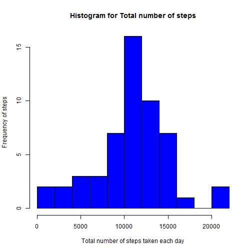
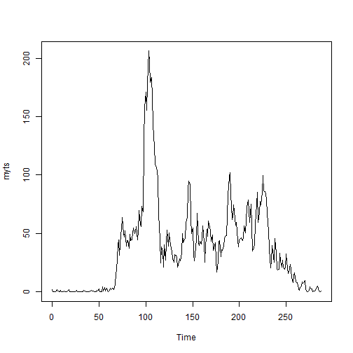
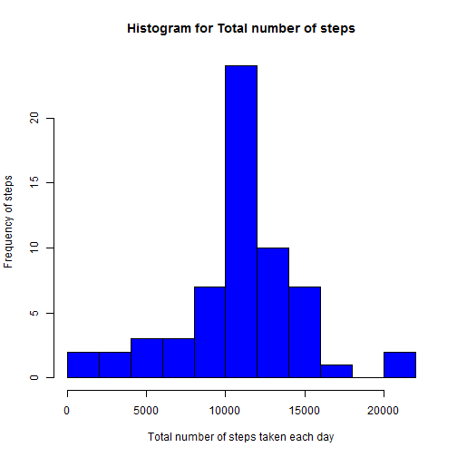
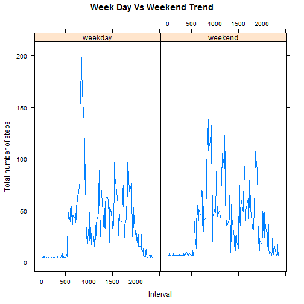
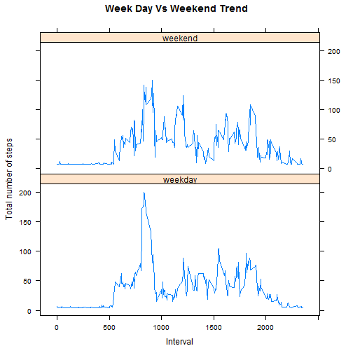

```r
    Data_Raw <- read.csv('activity.csv', header = TRUE) 

    str(Data_Raw)
```

```
## 'data.frame':	17568 obs. of  3 variables:
##  $ steps   : int  NA NA NA NA NA NA NA NA NA NA ...
##  $ date    : Factor w/ 61 levels "2012-10-01","2012-10-02",..: 1 1 1 1 1 1 1 1 1 1 ...
##  $ interval: int  0 5 10 15 20 25 30 35 40 45 ...
```

```r
    Data_Raw$date <- as.POSIXct(Data_Raw$date) 
    Data_Raw$date <- as.Date(Data_Raw$date, format = "%m/%d/%Y") 

      Data_wo_na <- na.omit(Data_Raw)

      Data_wo_na_sum<-aggregate(Data_wo_na$steps, by = list(date = Data_wo_na$date),sum)

      
      hist(Data_wo_na_sum$x, breaks = 8,col="blue", xlab="Total number of steps taken each day",ylab="Frequency of steps", main="Histogram for Total number of steps")
```

 

```r
      Mean_steps_wo_na <- mean(Data_wo_na$steps) 

      Median_steps_wo_na <- median(Data_wo_na$steps) 
      Data_avg_by_interval <- aggregate(Data_wo_na$steps, by = list(Data_wo_na$interval),mean)
      
    
      myts <- ts(Data_avg_by_interval$x, start = 0 , end = 287) 
      
      plot(myts, type = "l")
```

 

```r
      maximum_steps <- max(myts)
   
         NA_list <- which(is.na(Data_Raw$steps)) 
         NA_count <-length(NA_Count) 
  
         Unique_count <- unique (unlist(lapply (Data_Raw, function (x) which (is.na (x))))) 
  
      library("gam") 
  
      Data_with_NA_treated <- na.gam.replace(Data_Raw)
  
      Unique_count2 <- unique (unlist(lapply (Data_with_NA_treated, function (x) which (is.na (x))))) 
      New_Data<-Data_with_NA_treated
  
  
    
      Mean_steps_New_Data<- mean(New_Data$steps) 

      Median_steps_New_Data <- median(New_Data$steps) 
      Data_with_na_sum<-aggregate(Data_with_NA_treated$steps, by = list(date = Data_with_NA_treated$date),sum)

      hist(Data_with_na_sum$x, breaks = 8,col="blue", xlab="Total number of steps taken each day",ylab="Frequency of steps", main="Histogram for Total number of steps")
```

 

```r
      Data_with_Week_details <-Data_with_NA_treated

      Data_with_Week_details$weekday_end<-ifelse(weekdays(as.Date(Data_with_Week_details$date)) %in% c('Saturday','Sunday'), "weekend", "weekday")

  
      Data_avg_by_interval_by_weekday_end <- aggregate(Data_with_Week_details$steps, by = list(interval=Data_with_Week_details$interval, week_day_end = Data_with_Week_details$weekday_end), mean)


 
    library("lattice") 

    xyplot(x~interval|week_day_end, data=Data_avg_by_interval_by_weekday_end, type="l", xlab="Interval",ylab="Total number of steps", main="Week Day Vs Weekend Trend")
```

 


```r
plot(myts, type = "l")
```

 

```r
xyplot(x~interval|week_day_end, data=Data_avg_by_interval_by_weekday_end, type="l", xlab="Interval",ylab="Total number of steps", main="Week Day Vs Weekend Trend",layout=c(1,2))
```

 
